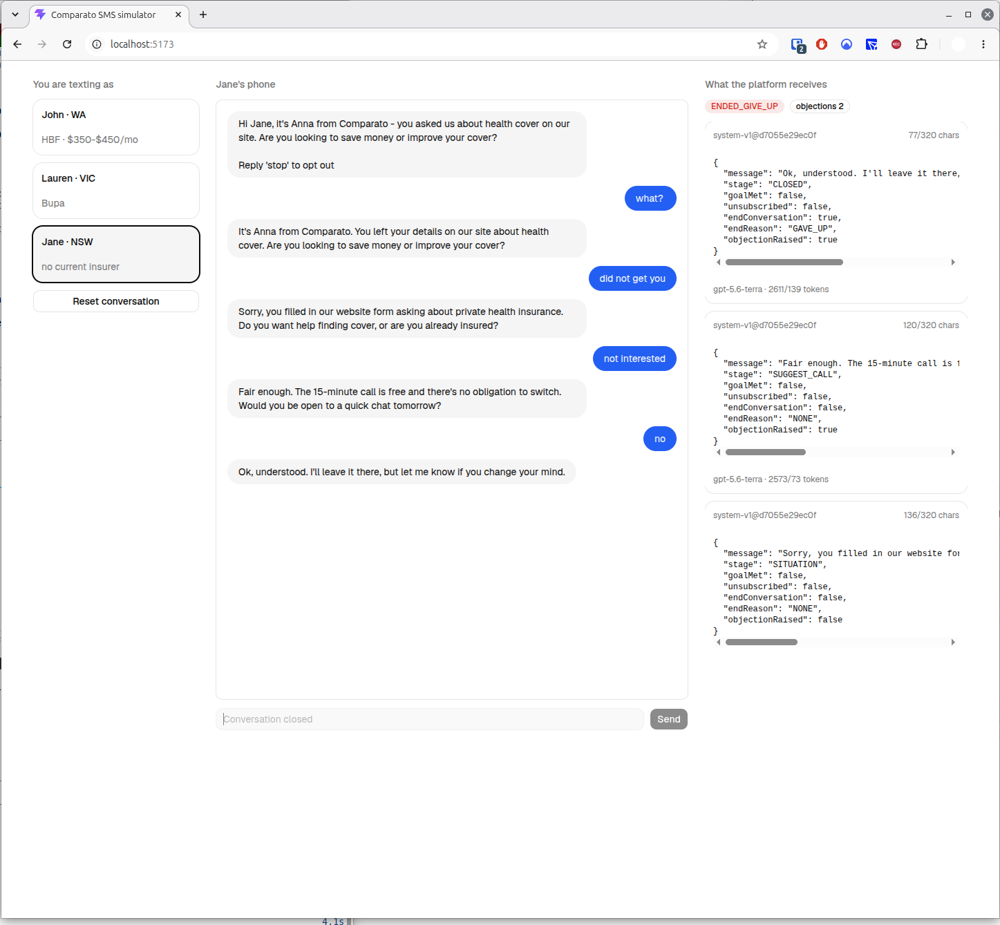

# Enrola — Comparato SMS Sales Agent (prototype)

An SMS conversational agent that takes a health-insurance lead from cold contact to a booked
call with a human advisor. Built as the first instance of a pattern, not a one-off.

## Run it

```bash
cp -n .env.example .env   # add your OpenAI key; -n keeps an existing .env
docker compose up
```

Then open http://localhost:5173. Pick a lead, and text the agent as if you were them.



The first lead, John, opens on a pre-seeded completed conversation — a booked call, copied
verbatim from a real live run and seeded by `data.sql` — so the agent's wording and everything
in the inspector column can be read without an API key. Lauren and Jane start from nothing, and
replying to anyone or resetting a thread calls the model: those need the key.

## What this is

The browser is standing in for the SMS transport. Enrola's platform owns sending and
receiving; here you play the lead, and the agent's replies arrive as if they were inbound
SMS on the lead's phone. The right-hand column shows what the *platform* receives and the
lead never sees: the structured output for each turn, the conversation status, which prompt
version produced the message, and its length against the 320-character limit.

Close the tab, restart the containers, reopen: the thread is still there. The browser holds
only the conversation id, in `localStorage`, and re-fetches the conversation from
`GET /api/conversations/{id}` on mount; an id that no longer resolves is dropped and you get
the lead list back. Everything else lives in Postgres, and the schema is created only if
absent, so nothing is wiped on boot. That is the "a conversation can pause for two days"
property being demonstrated rather than asserted.

## Architecture

Three containers, one outbound dependency, one bind mount.

```
  browser  ──▶  frontend :5173   ──▶  backend :8080  ──▶  postgres :5432
               (Vite dev server)     (Java 21 / Spring)   (leads, conversations,
                localStorage:                │             messages, bookings)
                conversation id              │
                                             ├──▶  OpenAI Responses API
                                             │      (structured output + 2 tools)
                                             └──◀   ./customers  (bind mount:
                                                    yaml + prompt + info pack,
                                                    re-read on mtime change)
```

The frontend holds no state but the conversation id. Every action returns the whole
`ConversationDto` — status, lead, all messages with their structured output, bookings — and the
UI re-renders from that. There is no polling, no websocket, no client-side model of the thread.

### API

| | |
|---|---|
| `GET /api/leads` | the seeded leads, for the picker |
| `POST /api/conversations` | "a lead was ingested, send the opener". **Resumes** the lead's existing conversation if there is one, rather than opening a second |
| `GET /api/conversations/{id}` | rehydrate after a restart |
| `POST /api/conversations/{id}/messages` | "an inbound SMS arrived" |
| `POST /api/conversations/{id}/reset` | delete the thread and open again — the only path that starts over |

The first two and the fourth are what Enrola's platform would call. The other two exist for the
simulator.

### One turn

`AgentService.handleInbound` is a single `@Transactional` unit — a model failure rolls the whole
thing back, including the inbound.

1. Reject if the conversation is in a terminal status.
2. Read the history, *then* save the inbound, so the current message is not also in the transcript.
3. Exact opt-out (`stop`, `unsubscribe`, …) → send the fixed confirmation, `UNSUBSCRIBED`, done.
   Zero tokens.
4. `PromptBuilder` assembles the input: system prompt, info pack, runtime context (agent name,
   char budget, advisor-timezone clock, objection count), then the lead's own form data at
   *developer* role, then the transcript, then the inbound at user role.
5. `callWithTools` loops the model against `get_available_times` and `book_call`, bounded at
   `MAX_TOOL_ROUNDS = 2`.
6. Parse the structured output into an `AgentTurn`.
7. Model flagged an opt-out → discard its message, send the fixed confirmation, keep its output
   as evidence.
8. `toGsm7` normalises, *then* the length check runs against `charBudget`. Over budget → one
   regenerate nudge → still over → truncate at a sentence and `log.warn`.
9. Persist the outbound with prompt version, model, token counts and the structured output that
   produced it; write the booking row if `book_call` fired.
10. `nextState` computes the new status.

The opening message (`start`, `reset`) is the same path with no inbound and an empty history.

### Status

`nextState` checks in this order, and the order is the logic:

```
endReason == ABUSE      → ENDED_ABUSE        abuse wins outright
status was GOAL_MET     → GOAL_MET_CLOSED    the turn after a booking closes the thread
objections >= 2         → ENDED_GIVE_UP      code backstop: never push a third time
goalMet                 → GOAL_MET           book_call returned an id
endConversation         → ENDED_GIVE_UP      the model gave up
otherwise               → ACTIVE
```

Everything below `ENDED_ABUSE` is terminal and rejects further inbound.

### Where things are

| | |
|---|---|
| `backend/…/engine/` | the turn: `AgentService`, `PromptBuilder`, `Guardrails`, `OpenAiLlmClient`, `AgentTurn` |
| `backend/…/web/` | the five endpoints and the DTOs |
| `backend/…/conversation/`, `lead/` | the rows, as records over Spring Data JDBC |
| `backend/…/customer/` | `CustomerRegistry` — scans `customers/`, one directory per customer |
| `backend/…/calendly/` | the stub, driven by the injected `Clock` |
| `customers/comparato/` | `customer.yaml`, `system-v1.md`, `info-pack.md` |
| `backend/…/resources/` | `schema.sql` (4 tables, `create table if not exists`) and `data.sql` (leads + the seeded thread) |
| `frontend/src/` | `App.tsx` owns the state; `LeadPicker` / `Thread` / `Inspector` are the three columns |

## Assumptions

- **Lead ingestion, SMS delivery and scheduling of the first message belong to the Enrola
  platform.** This service exposes the API the platform would call: "a lead was ingested,
  send the opener" and "an inbound SMS arrived".
- **The lead API and Calendly are stubbed**, as suggested. Lead data is seeded into Postgres;
  Calendly is a deterministic slot generator driven by an injected `Clock`.
- **One conversation is single-threaded.** A lead cannot text twice at once in any way that
  matters at prototype scale.
- **One advisor timezone per customer** — `Australia/Perth`, from
  `customers/comparato/customer.yaml`. Slots are offered in the customer's zone, not the lead's,
  so a seeded VIC lead is offered Perth business hours. A state-to-zone map is the right fix once
  we know where advisor coverage actually sits.

## Trade-offs

- **A separate React frontend rather than Java/Thymeleaf.** The brief's hint is explicitly
  soft — Java/Thymeleaf "would make my life easier", followed by "if you want to go another
  way, that's ok too". That is a preference about review convenience, not an architectural
  requirement. The honest boundary between the platform and the agent is a JSON API, and
  building the UI against that same API proves the seam works. The backend is Java/Spring
  Boot exactly as requested. The frontend container runs the Vite dev server and nothing
  else — no nginx, no production build, no reverse proxy.
- **No message queue and no worker.** This is an async conversation that can pause for two
  days, not a chat session, so the real requirement is that state survives the process.
  Postgres satisfies it. Every inbound SMS is an independent HTTP request that loads state,
  produces one turn and persists. Where a queue would go at 750 leads/week is described
  under Scaling below rather than built.
- **Guardrails are enforced in code, not requested in a prompt.** The model is asked to
  handle each guardrail *and* code enforces it before the message is sent. Two of them —
  staying in role under prompt injection, and admitting to being AI — have no code backstop,
  because neither is mechanically detectable. They are covered by live scenarios instead,
  and that is named here rather than glossed over. The same split runs through the tools:
  `book_call` takes a start time and nothing else, and the code fills in the lead's name,
  phone and email from the `Lead` row. Those details are never placed in the model's context,
  so a prompt injection can at worst move the appointment — it cannot redirect the invite to
  an attacker's address.
- **The character limit is a billing limit, not a style rule.** The model writes typographic
  punctuation — `’`, `—`, `…` — and none of it is in the GSM-7 alphabet. One such character
  forces the whole SMS into UCS-2, dropping the segment size from 160 characters to 70, which
  took the 219-character opener from two billed segments to four. `Guardrails.toGsm7`
  substitutes before the length check, because `...` is longer than the `…` it replaces. It is
  a real cost bug that a prompt instruction does not reliably fix, which is the argument for
  code guardrails in one example.
- **The prompt is a versioned file, not a string constant.** Edit
  `customers/comparato/system-v1.md` and send the next message; it reloads on mtime change.
  Every outbound message records which prompt content produced it.

## Not built

Message queue / worker. Real Calendly and lead API integration. SMS delivery, webhooks,
lead ingestion. Auth, rate limiting, PII redaction. Production frontend build, nginx, TLS.
Flyway migrations, Kubernetes, observability stack. Whole-conversation LLM-as-judge scoring.

`toGsm7` is a normaliser, not a validator: it covers the punctuation a model realistically
produces, so an emoji still passes through and silently restores the four-segment cost. The
full GSM-7 alphabet plus its extension set is the fix, worth writing the first time a message
actually gets one.

## Tests

```bash
cd backend && ./mvnw verify           # 70 tests: unit + service slice. No API key. Needs Docker.
cd backend && ./mvnw verify -Plive    # 76: adds four live scenarios and two API-contract checks.
                                      # Needs OPENAI_API_KEY, and costs money.
cd frontend && pnpm lint && pnpm exec tsc -b && pnpm build
```

The frontend line is the only command in this README that is not Docker-only: it needs Node 24
and pnpm on the host. It is `tsc -b`, not `tsc --noEmit` — under this project-references layout
`--noEmit` checks zero files and exits 0 whatever the state of the code.

`.github/workflows/ci.yml` runs both of those on every push and pull request: the default
backend suite, and the frontend line above. The live scenarios stay out of CI because they cost
money per run and are not deterministic. Their committed transcripts are in
`evals/transcripts/` — a booked call, a lead who objects twice and opts out, a prompt injection
the agent declines without leaving its stage, and a lead who asks whether they are talking to a
bot and gets a straight yes.

## Measuring quality in production

Tests prove the code does what it says; none of them prove the agent is working. What I would
watch, all of it derivable from what the schema stores except where noted — and one of them is
a trap.

- **Booking rate per prompt version.** `messages.prompt_version` is the prompt file's name plus
  a hash of its content, stamped on every outbound message. Two prompt versions are therefore
  comparable on the same funnel without guessing which edit was live when, and a regression is
  attributable to a specific prompt change rather than to last Tuesday.
- **Drop-off by stage, and messages per booking.** Every turn's structured output is persisted
  in `messages.structured_output`, `stage` included, so the funnel is measurable per step rather
  than end to end. "40% never answer the opening question" is actionable; "our booking rate is
  12%" is not. Message count against `bookings` is the same question from the cost side: a
  booking in four messages and a booking in twelve are not the same outcome.
- **Opt-out rate.** `conversations.status = UNSUBSCRIBED` over conversations started. A prompt
  that books more calls while burning more of the list is not an improvement, and without this
  number it looks like one.
- **Guardrail-violation rate.** The one metric the schema does not give: a message that goes
  over the limit is a `log.warn` in `AgentService`, greppable but not queryable. A counter on it
  is the first production change I would make, because a rising truncation rate is the earliest
  evidence that a prompt edit drifted past the character budget.
- **A human spot-check sample.** Twenty conversations a week, read by a person. Tone is what no
  metric catches, and tone decides whether a lead replies at all.

**The metric I would stop trusting first is booking rate.** It rewards pressure. The customer's
real goal is advisor calls that convert, and that data is not in this system — until call
outcomes come back, a rising booking rate could equally mean the agent got better at persuading
or better at nagging. I would ask for outcome data in the first iteration after launch and treat
booking rate as directional until it arrives.

## Scaling to 750 leads a week

750 leads a week is about two an hour, and a conversation is six or seven messages spread over
days. It is not a throughput problem. It breaks in this order.

1. **The synchronous turn.** An inbound SMS is an HTTP request that calls a frontier model
   inside a transaction, so p99 is however slow the model is that minute and a database
   connection is held for the whole of it. This is the first thing to move, and the seam is
   already the right shape: a turn loads state, produces one message, persists. Accept the
   webhook, enqueue, return 200 — the turn itself does not change.
2. **Redelivery.** A queue brings duplicates, and a redelivered inbound texts the lead twice.
   The fix is an idempotency key on the inbound, which the platform's own message id supplies.
   Nothing needs it today because nothing retries today.
3. **Two messages on one conversation at once.** Both would load the same history and produce
   two replies. Nothing locks, and that is stated in Assumptions rather than tested; the fix is
   an optimistic version column on `conversations`.
4. **Rate limits and cost, not CPU.** Roughly 5,000 model calls a week is a token-budget and
   provider-limit question long before it is a JVM one. Cost per booked call is already
   computable from `messages.tokens_in` and `tokens_out`.

**Customer number two is a directory.** `customers/<id>/` holds a yaml file, a prompt and an
info pack; the registry scans the directory at startup and refuses to start if a directory name
and the id inside it disagree. No Java change, no migration. What is deliberately not built is a
`CustomerStrategy` interface or a tenant table — one customer cannot tell us the right shape,
and the second one will.

**What I would delete first:** the `stage` field, if it turned out nobody looked at the funnel.
It is the one piece of the structured output that exists for observability rather than for the
platform contract, and it costs tokens on every turn.

## Generated code

`frontend/src/components/ui/` is generated by shadcn/ui and left as generated — button, input,
card, badge, scroll-area, select. `noUnusedLocals` is off in `frontend/tsconfig.app.json` for
that reason: one of those files trips it, and lowering a project-wide bar for generated code is
better than editing code this README describes as untouched. Everything else under
`frontend/src/` is hand-written.
